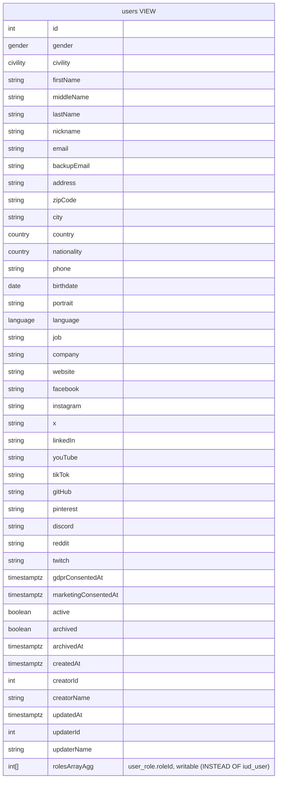

```mermaid
---
caption: Views Entity Relationship Diagram
---

erDiagram

  users["users VIEW"] {
    int id
    gender gender
    civility civility
    string firstName
    string middleName
    string lastName
    string nickname
    string email
    string backupEmail
    string address
    string zipCode
    string city
    country country
    country nationality
    string phone
    date birthdate
    string portrait
    language language
    string job
    string company
    string website
    string facebook
    string instagram
    string x
    string linkedIn
    string youTube
    string tikTok
    string gitHub
    string pinterest
    string discord
    string reddit
    string twitch
    timestamptz gdprConsentedAt
    timestamptz marketingConsentedAt
    boolean active
    boolean archived
    timestamptz archivedAt
    timestamptz createdAt
    int creatorId
    string creatorName
    timestamptz updatedAt
    int updaterId
    string updaterName
    int[] rolesArrayAgg "user_role.roleId, writable (INSTEAD OF iud_user)"
  }
```
