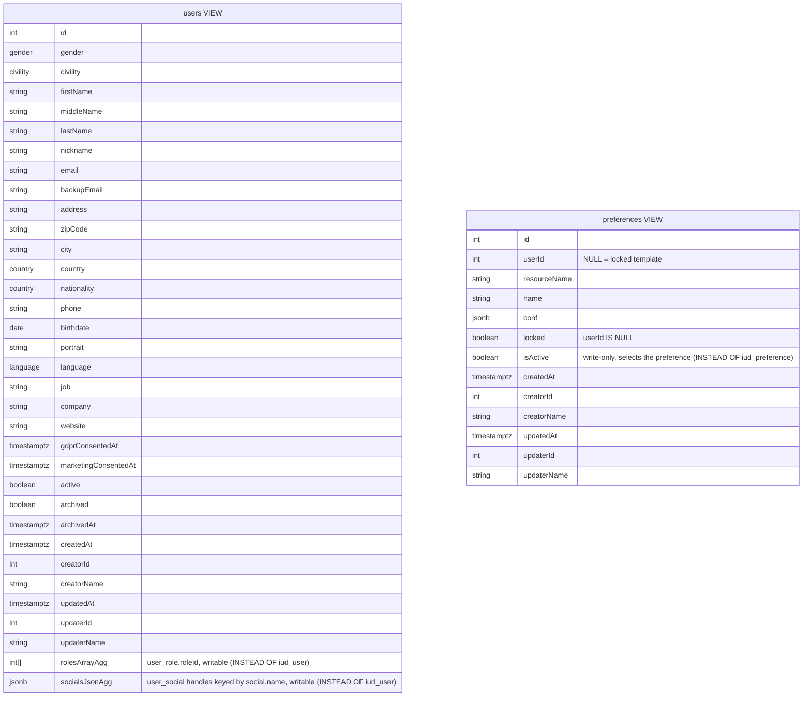

```mermaid
---
caption: Views Entity Relationship Diagram
---

erDiagram

  users["users VIEW"] {
    int id
    gender gender
    civility civility
    string firstName
    string middleName
    string lastName
    string nickname
    string email
    string backupEmail
    string address
    string zipCode
    string city
    country country
    country nationality
    string phone
    date birthdate
    string portrait
    language language
    string job
    string company
    string website
    timestamptz gdprConsentedAt
    timestamptz marketingConsentedAt
    boolean active
    boolean archived
    timestamptz archivedAt
    timestamptz createdAt
    int creatorId
    string creatorName
    timestamptz updatedAt
    int updaterId
    string updaterName
    int[] rolesArrayAgg "user_role.roleId, writable (INSTEAD OF iud_user)"
    jsonb socialsJsonAgg "user_social handles keyed by social.name, writable (INSTEAD OF iud_user)"
  }

  preferences["preferences VIEW"] {
    int id
    int userId "NULL = locked template"
    string resourceName
    string name
    jsonb conf
    boolean locked "userId IS NULL"
    boolean isActive "write-only, selects the preference (INSTEAD OF iud_preference)"
    timestamptz createdAt
    int creatorId
    string creatorName
    timestamptz updatedAt
    int updaterId
    string updaterName
  }
```
