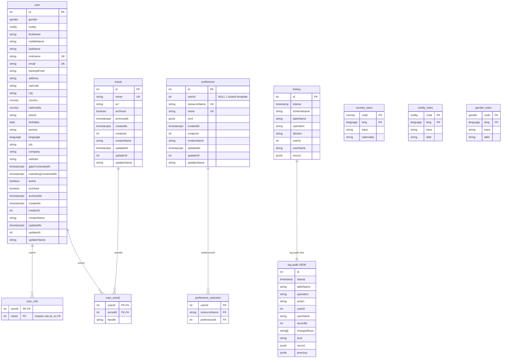

```mermaid
---
caption: Entity Relationship Diagram - Megadex
---

erDiagram

  user ||--o{ user_role : "userId"
  user ||--o{ user_social : "userId"
  social ||--o{ user_social : "socialId"
  preference ||--o{ preference_selection : "preferenceId"
  history ||--|| audit : "log.audit view"

  user {
    int id PK
    gender gender
    civility civility
    string firstName
    string middleName
    string lastName
    string nickname UK
    string email UK
    string backupEmail
    string address
    string zipCode
    string city
    country country
    country nationality
    string phone
    date birthdate
    string portrait
    language language
    string job
    string company
    string website
    timestamptz gdprConsentedAt
    timestamptz marketingConsentedAt
    boolean active
    boolean archived
    timestamptz archivedAt
    timestamptz createdAt
    int creatorId
    string creatorName
    timestamptz updatedAt
    int updaterId
    string updaterName
  }

  user_role {
    int userId PK, FK
    int roleId PK "Gatelin role id, no FK"
  }

  user_social {
    int userId PK, FK
    int socialId PK, FK
    string handle
  }

  social {
    int id PK
    string name UK
    string url
    boolean archived
    timestamptz archivedAt
    timestamptz createdAt
    int creatorId
    string creatorName
    timestamptz updatedAt
    int updaterId
    string updaterName
  }

  preference {
    int id PK
    int userId "NULL = locked template"
    string resourceName UK
    string name UK
    jsonb conf
    timestamptz createdAt
    int creatorId
    string creatorName
    timestamptz updatedAt
    int updaterId
    string updaterName
  }

  preference_selection {
    int userId PK
    string resourceName PK
    int preferenceId FK
  }

  country_trans {
    country code PK
    language lang PK
    string trans
    string nationality
  }

  civility_trans {
    civility code PK
    language lang PK
    string trans
    string abbr
  }

  gender_trans {
    gender code PK
    language lang PK
    string trans
    string abbr
  }

  history {
    int id PK
    timestamp tstamp
    string schemaName
    string tableName
    string operation
    string dbUser
    int userId
    string userName
    jsonb record
  }

  audit["log.audit VIEW"] {
    int id
    timestamp tstamp
    string tableName
    string operation
    string action
    int userId
    string userName
    int recordId
    string[] changedKeys
    string kind
    jsonb record
    jsonb previous
  }

```
