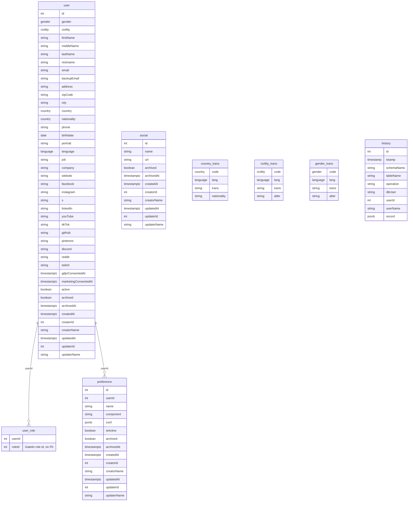

```mermaid
---
caption: Diagramme entité-relation de megadex
---

erDiagram

  user ||--o{ user_role : "userId"
  user ||--o{ preference : "userId"

  user {
    int id
    gender gender
    civility civility
    string firstName
    string middleName
    string lastName
    string nickname
    string email
    string backupEmail
    string address
    string zipCode
    string city
    country country
    country nationality
    string phone
    date birthdate
    string portrait
    language language
    string job
    string company
    string website
    string facebook
    string instagram
    string x
    string linkedIn
    string youTube
    string tikTok
    string gitHub
    string pinterest
    string discord
    string reddit
    string twitch
    timestamptz gdprConsentedAt
    timestamptz marketingConsentedAt
    boolean active
    boolean archived
    timestamptz archivedAt
    timestamptz createdAt
    int creatorId
    string creatorName
    timestamptz updatedAt
    int updaterId
    string updaterName
  }

  user_role {
    int userId
    int roleId "Gatelin role id, no FK"
  }

  preference {
    int id
    int userId
    string name
    string component
    jsonb conf
    boolean isActive
    boolean archived
    timestamptz archivedAt
    timestamptz createdAt
    int creatorId
    string creatorName
    timestamptz updatedAt
    int updaterId
    string updaterName
  }

  social {
    int id
    string name
    string url
    boolean archived
    timestamptz archivedAt
    timestamptz createdAt
    int creatorId
    string creatorName
    timestamptz updatedAt
    int updaterId
    string updaterName
  }

  country_trans {
    country code
    language lang
    string trans
    string nationality
  }

  civility_trans {
    civility code
    language lang
    string trans
    string abbr
  }

  gender_trans {
    gender code
    language lang
    string trans
    string abbr
  }

  history {
    int id
    timestamp tstamp
    string schemaName
    string tableName
    string operation
    string dbUser
    int userId
    string userName
    jsonb record
  }

```
