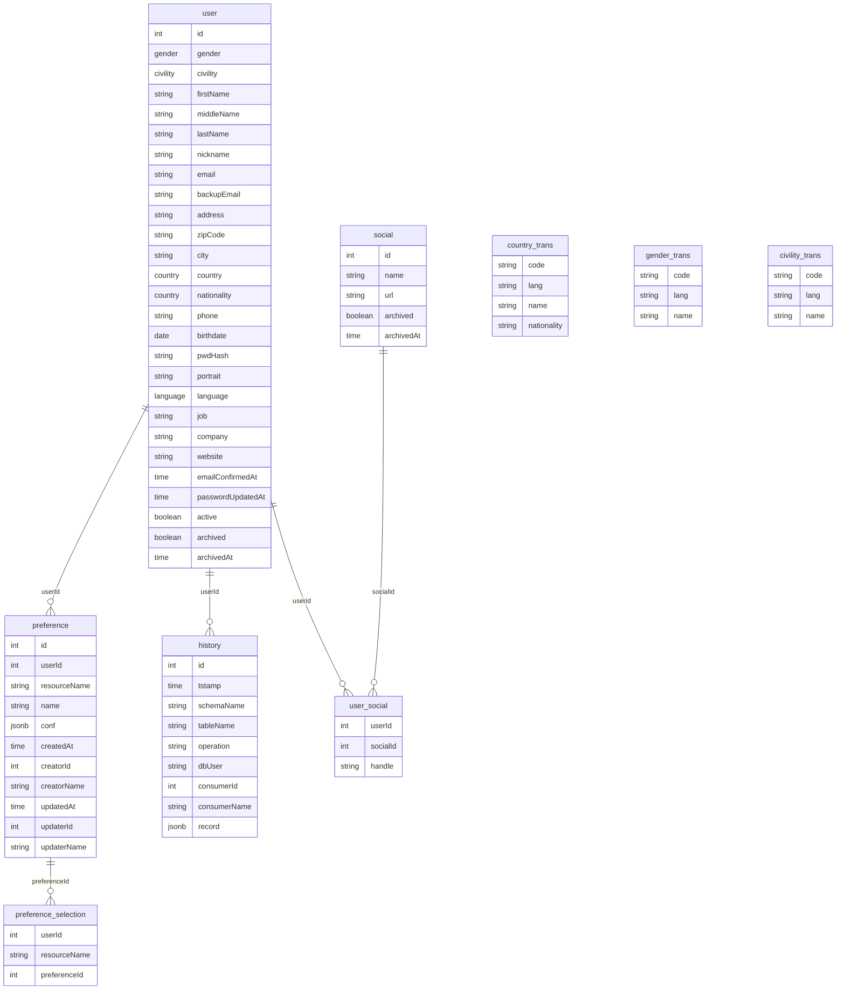

```mermaid
---
caption: Diagramme entité-relation de ms_user
---

erDiagram
  
  user ||--o{ preference : "userId"
  preference ||--o{ preference_selection : "preferenceId"
  user ||--o{ history : "userId"
  user ||--o{ user_social : "userId"
  social ||--o{ user_social : "socialId"

  user {
    int id
    gender gender
    civility civility
    string firstName
    string middleName
    string lastName
    string nickname
    string email
    string backupEmail
    string address
    string zipCode
    string city
    country country
    country nationality
    string phone
    date birthdate
    string pwdHash
    string portrait
    language language
    string job
    string company
    string website
    time emailConfirmedAt
    time passwordUpdatedAt
    boolean active
    boolean archived
    time archivedAt
  }

  preference {
    int id
    int userId
    string resourceName
    string name
    jsonb conf
    time createdAt
    int creatorId
    string creatorName
    time updatedAt
    int updaterId
    string updaterName
  }

  preference_selection {
    int userId
    string resourceName
    int preferenceId
  }

  country_trans {
    string code
    string lang
    string name
    string nationality
  }

  gender_trans {
    string code
    string lang
    string name
  }

  civility_trans {
    string code
    string lang
    string name
  }

  social {
    int id
    string name
    string url
    boolean archived
    time archivedAt
  }

  user_social {
    int userId
    int socialId
    string handle
  }

  history {
    int id
    time tstamp
    string schemaName
    string tableName
    string operation
    string dbUser
    int consumerId
    string consumerName
    jsonb record
  }

```
